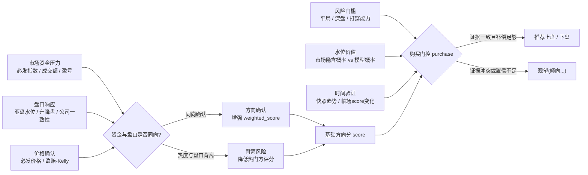
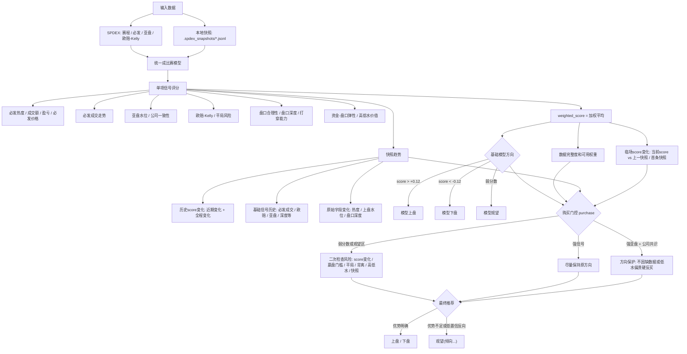

```
python3 worldcup_ah_cli.py --help
python3 worldcup_ah_cli.py predict --help
python3 worldcup_ah_cli.py upcoming --help
python3 worldcup_ah_cli.py snapshot --help
python3 worldcup_ah_cli.py trend --help
python3 worldcup_ah_cli.py watch --help
python3 worldcup_ah_cli.py sources --help
```

核心信号：

- 必发指数、成交额、盈亏指数、必发价格确认
- 必发成交走势
- 亚盘水位和主流公司一致性
- 欧赔/Kelly 与平局风险
- 盘口合理性、盘口深度、深盘打穿能力、赢盘门槛风险
- 资金/盘口弹性：热度变化后，盘口是否降水、升盘或反向放松
- 高低水价值：把水位转换成隐含赢盘率，比较模型概率是否给出足够赔率补偿
- 外部赔率/实力校验：预留 The Odds API、Elo、伤停/阵容模型字段
- 本地 `.spdex_snapshots/` 快照趋势
- 临场 `score` 变化：当前综合分相对上一条/首条快照的变化

信号之间的关系：

所有信号都会先被归一到同一个方向坐标：`+1` 表示支持上盘，`-1` 表示支持下盘，`0` 表示中性或不可用。因此它们可以进入同一个加权模型。但模型不是简单相信“哪个信号大”，而是重点看信号之间是否互相确认：

- 必发热度、成交额、盈亏指数代表市场资金压力。
- 亚盘水位、升降盘、主流公司一致性代表盘口是否响应这股资金压力。
- 必发价格、欧赔/Kelly 代表价格端是否确认强弱方向。
- 平局风险、盘口深度、打穿能力、赢盘门槛风险代表买上盘是否需要更高胜出条件。
- 高低水价值把水位换算成市场隐含概率，判断当前赔率是否给了足够补偿。
- 快照趋势和临场 `score` 变化负责时间维度，判断信号是在增强、转弱，还是临场突然反向。

最核心的关系是：如果热门方资金很热，盘口也通过降水或升盘响应，价格端也确认，这通常是同向确认；如果热门方很热，但盘口不升反降、上盘升水，或临场 `score` 明显转弱，就会被视为背离信号。



算法流程图：



推荐逻辑：

- `score` 是基础模型综合分，默认阈值为 `+/-0.12`：正分偏上盘，负分偏下盘，弱分数为观望。
- `score` 的变化很重要：快照趋势会同时看最近一段 `score` 变化、从第一条到最新一条的总变化，以及必发成交、欧赔/Kelly、亚盘水位、盘口深度等基础信号的历史变化。
- 目前快照趋势里，历史 `score` 变化约占趋势判断的 35%；基础信号历史约占 65%。如果热度升高但上盘水位也升高，会额外扣分；如果热度升高且上盘降水，会额外加分。
- 预测本轮还会额外生成 `临场score变化`：用当前刚算出的 `score` 对比上一条快照和首条快照。它不进入基础 `weighted_score`，但会进入 `purchase` 门控；如果当前 `score` 跌破/升破阈值，或与历史快照趋势冲突，会直接修正购买分，并降低旧快照趋势的影响。
- 最终 `推荐` 是购买建议，可以是 `上盘`、`下盘` 或 `观望(倾向...)`；低置信反向、可用数据不足、方向和购买优势都太弱时不会强行二选一。
- `purchase` 是购买门控后的分数。只有当原始优势较弱或模型处于观望区时，才会额外参考赢盘门槛风险、快照趋势、盘口背离、公司一致性、高低水价值等信号做二次修正。
- 强亚盘水位和主流公司一致性同向时，会保护原方向，避免因为缺实时接口或低水偏贵被硬反买；缺数据更多体现为降低置信度。
- 高水只有在模型估计赢盘率明显高于市场隐含概率时才加分；低水如果已经偏贵但缺少模型溢价会扣分，但遇到强盘口共识时会降权处理。
- `置信度` 表示最终购买建议的把握，不等于命中概率；数据越完整、基础分越强、快照和盘口越同向，置信度越高。风险门控、数据缺口、反向证据会降低置信度。

自动快照：

```bash
python3 worldcup_ah_cli.py watch --limit 20 --verbose
```

`watch` 会扫描未来 24 小时比赛，按 `T-24h/T-8h/T-4h/T-3h/T-2h/T-60m/T-30m/T-15m` 自动保存快照并打印预测。

- `T-24h/T-8h/T-4h/T-3h/T-2h`：预判窗口，用来积累必发、赔率、盘口和水位趋势。
- `T-60m/T-30m/T-15m`：正式复核/确认窗口，用来形成临场购买建议。
