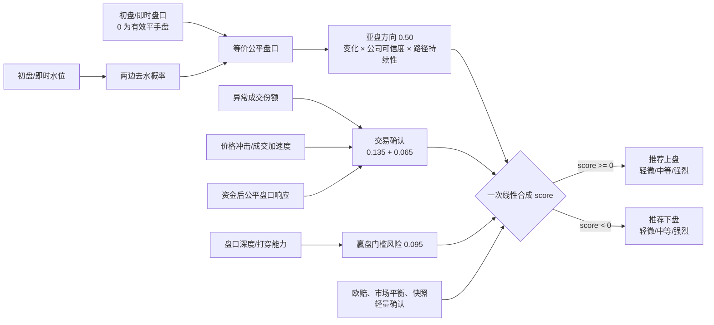
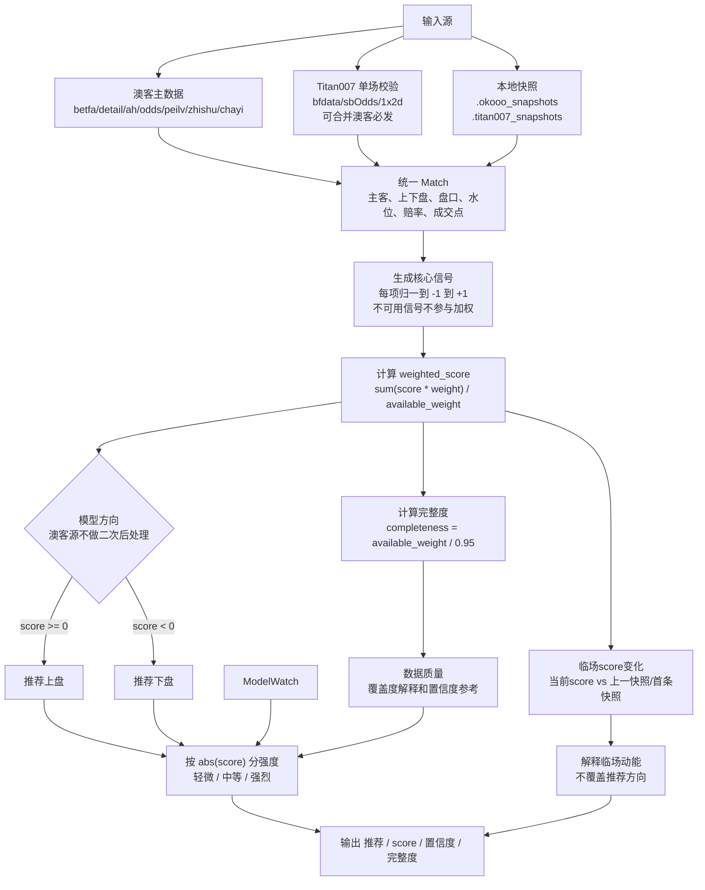

# WorldCup 亚盘推荐工具

当前推荐主线以澳客为主，另外保留 Titan007 做单场交叉校验：

1. `okooo_ah_cli.py`：主力入口。直接抓澳客的必发、盘口、欧赔/Kelly、胜负指数、差异分析和必发成交明细，数据最完整，适合预测、保存快照和赛前滚动观察。
2. `scripts/titan007_one_match.py`：单场交叉校验入口。用 Titan007 的赛程、亚盘矩阵、百家欧赔补充观察，并默认合并澳客必发数据，适合知道球探 `ScheduleID` 后快速跑一场。

底层逻辑：**钱往哪边去之后，盘口和交易市场有没有被迫承认这个方向；只有资金热度、成交走势、盘口水位、赔率/Kelly 和风险门槛相互确认时才给出更高强度，出现背离就降为轻微或反向。**

两者最终都复用同一套 `Predictor` 推荐算法，所以输出里的推荐方向、`score`、强度分层、信号名称和信号总结口径一致。

## 快速开始

把浏览器里的澳客 Cookie 放到仓库根目录 `.env`：

```bash
OKOOO_COOKIE='acw_tc=...; PHPSESSID=...; ...'
```

Cookie 不是按每场比赛单独生成的。它主要是站点会话和 WAF 校验信息，通常同一浏览器会话可访问多个 match id；如果出现 405、阻断页或明细为空，刷新浏览器 Cookie 后再跑。

先检查澳客数据源：

```bash
python3 okooo_ah_cli.py sources
```

列出世界杯比赛：

```bash
python3 okooo_ah_cli.py upcoming --world-cup --all-future --limit 30
```

预测单场澳客 match id：

```bash
python3 okooo_ah_cli.py predict --match-id 1316320 --verbose
python3 okooo_ah_cli.py predict --match-id 1316320 --json
```

按赛前窗口滚动保存世界杯快照：

```bash
python3 okooo_ah_cli.py watch --world-cup --horizon-hours 72 --limit 20 --verbose
```

用 Titan007 查未来场次并带出澳客 id：

```bash
python3 scripts/titan007_one_match.py upcoming -w --hours 168 --limit 40
python3 scripts/titan007_one_match.py upcoming -w --hours 168 --limit 40 --json
```

用 Titan007 单场预测。第一个参数是纯数字时等价于 `predict <ScheduleID>`：

```bash
python3 scripts/titan007_one_match.py 2906745
python3 scripts/titan007_one_match.py predict 2906745 --okooo-ids 2906745=1316319 --json
```

## 澳客主入口

### 常用命令

```bash
python3 okooo_ah_cli.py --help
python3 okooo_ah_cli.py sources
python3 okooo_ah_cli.py upcoming --world-cup --hours 72 --limit 30
python3 okooo_ah_cli.py upcoming --world-cup --all-future --full
python3 okooo_ah_cli.py predict --match-id 1316320 --verbose --save-snapshot
python3 okooo_ah_cli.py snapshot --match-ids 1316320 1316319
python3 okooo_ah_cli.py trend --match-id 1316320
python3 okooo_ah_cli.py watch --world-cup --horizon-hours 72 --interval 120 --verbose
python3 okooo_ah_cli.py --no-dotenv validate-snapshots
```

`validate-snapshots`：不访问网络，只读本地 `.okooo_snapshots` 与 `tools/okooo_validate_scores.json`。每场取最后两条合格赛前快照，以两次预测 score 的中位数决定方向，并使用最新一条快照当时的真实盘口和水位结算；输出全赢、半赢、走水、半输、全输、单位净收益和 ROI。不足两条、赛后快照、历史导入和固定占位字段不会进入验证；缺失水位显示 unavailable，不进入 ROI。存在半输/全输时默认 **退出码 1**；仅打印统计可加 `--allow-miss`。

历史研究可用当前代码重放：

```bash
python3 okooo_ah_cli.py --no-dotenv validate-snapshots --allow-miss
```

正式的后续比赛采用冻结模型 walk-forward，只读取预测当时已经保存的结果，不允许未来代码重写旧预测：

```bash
python3 okooo_ah_cli.py --no-dotenv validate-snapshots \
  --walk-forward --allow-miss
```

冻结版本和代码指纹记录在 `tools/okooo_model_freeze.json`。新快照使用 schema 2，写入模型版本、代码指纹、距离开赛分钟数，以及预测时刻真实盘口和水位。

重要参数：

- `--issue dqjc`：澳客当前期路径，默认 `dqjc`，也可用 `OKOOO_ISSUE`。
- `--cookie-file PATH`：从文件读取 Cookie；否则读 `.env` 里的 `OKOOO_COOKIE`。
- `--detail-max-pages N`：必发明细分页最多抓取页数，默认 5。
- `--no-trade-trend`：关闭必发明细和近 3 小时成交接口探测。
- `--snapshot-dir DIR`：快照目录；未指定时默认使用**仓库根**下的 `.okooo_snapshots`（与当前工作目录无关），也可用 `OKOOO_SNAPSHOT_DIR`。
- `upcoming --world-cup`：只筛世界杯 / 世界盃 / World Cup。
- `watch --world-cup`：自动观察当前期所有世界杯比赛。

### 澳客数据源

`okooo_ah_cli.py` 会把澳客页面解析成 `Predictor` 能识别的 `Match`、`HandicapRow`、`EuroTrendPoint` 和 `PriceVolumePoint`：

- 必发指数页：`https://www.okooo.cn/jingcai/shuju/betfa/dqjc/`
  - 提供 match id、对阵、开赛时间、竞彩让球、必发指数、成交额、平局资金、盈亏、必发赔率。
  - 注意：这里的“竞彩让球”只作为元数据保存在 `_okooo_lottery_handicap`，**不作为亚盘盘口**。真实亚盘必须来自亚盘页；亚盘页缺失时不再用竞彩让球兜底，盘口会降级为 `0` 并降低模型可用度。
- 必发明细页：`https://www.okooo.cn/soccer/match/{match_id}/exchanges/detail/`
  - 需要 `OKOOO_COOKIE`。解析主/平/客每个时间点的价格、累计量、单笔量和可选买卖标记。
- 亚盘页：`https://www.okooo.cn/soccer/match/{match_id}/ah/`
  - 解析多家公司初盘线、即时线、水位、返还率，并生成亚盘矩阵。
  - 共识盘口用公司即时盘口的中位数；均水和评分只使用共识盘口附近的公司行，避免把 `-0.75`、`-1`、`-1.25` 不同盘口下的水位混算。
  - 澳客重点公司按固定顺序优先：`Bet365`、`澳门彩票`、`皇冠`、`韦德国际`、`立博`、`Interwetten`、`SNAI`、`Mansion 88`。
- 欧盘页：`https://www.okooo.cn/soccer/match/{match_id}/odds/`
  - 解析欧赔时间序列。
- 凯莉方差页：`https://www.okooo.cn/jingcai/shuju/peilv/dqjc/`
  - 解析均赔、Kelly 和公司数量。
- 胜负指数页：`https://www.okooo.cn/jingcai/shuju/zhishu/dqjc/`
  - 作为外部实力/指数校验字段。
- 差异分析页：`https://www.okooo.cn/jingcai/shuju/chayi/dqjc/`
  - 作为官方概率、热度、差异校验字段。
- 成交趋势兜底接口：`https://www.okooo.cn/danchang/shuju/ajax/?action=trend`
  - 当明细页不可用时尝试使用，数据粒度低于明细页。

### 澳客推荐算法

以 `okooo_ah_cli.py` 为例，它不是简单看谁热门就买谁，而是看“热门方向有没有被盘口、赔率和成交走势确认”：资金热、成交跟、盘口升深且水位变化与盘口配套、欧赔/Kelly 同步，才算被市场承认；如果资金很热但盘口不配合、赔率反向、平局或赢盘门槛太高，就降低推荐强度。水位升降会和盘口变化一起看：升盘伴随升水、降盘伴随降水通常属于正常配套，只有扣除盘口变化后的异常升水/降水才作为强信号。

输出方向统一为：

- `score >= 0`：推荐上盘。
- `score < 0`：推荐下盘。
- 强度按 `abs(score)` 分层：`<0.12` 为轻微，`0.12~0.25` 为中等，`>=0.25` 为强烈。终端输出形如 `上盘(轻微:日本)`，不再额外叠加购买门槛。

#### 近期算法调优在做什么（`worldcup_ah_cli.Predictor`）

目标可以概括成三句话：**盘口源必须干净，竞彩让球不能冒充亚盘**；**深盘 / 净胜类场次必须区分「赢球确认」和「赢盘确认」**；**浅盘或中盘大热如果缺少亚盘公司确认，先降级或压低强度，不把风险机械翻成下盘价值**。实现分两层：`okooo_ah_cli.py` 负责把澳客数据解析成干净盘口/赔率/资金结构，`worldcup_ah_cli.py` 的 `Predictor` 负责统一评分、边际修正和强度分层。

1. **亚盘来源保护**：`betfa` 的竞彩让球不写入 `AsianAvrLet`；只有 `ah` 页拿到公司盘口矩阵后，才生成真实亚盘共识。缺亚盘页时宁可降级为轻微方向，不用竞彩让球替代。
2. **平手盘不再等于缺失**：`HandicapRow` 分开保存盘口数值和 `init_line_known/latest_line_known` 可用性；`0` 是有效平手盘，只有显式不可用才按缺失处理。
3. **无水概率 → 等价公平盘口**：初盘和即时盘都先把两边水位换算成无水概率，再用 `报价盘口深度 + 0.55 × logit(无水概率)` 映射到同一条让球深度轴。盘口变化与水位变化不再使用固定系数校正，也不再重复拆成多个相关水位分量。
4. **亚盘方向只保留一条主轴**：各公司等价公平盘口变化取中位数，公司同向比例和离散度只形成可信度；临场阶段再比较最近约四小时的市场共识公平盘口，并额外识别“高点回撤/低点反弹”这类峰值后反转。最终由“当前公司方向 + 临场路径方向 + 极值回撤确认”合成，公司一致性仍展示，但不再独立重复加权。
5. **交易确认拆成三部分**：`必发成交走势` 比较近期成交份额相对既有资金结构的异常程度，并叠加价格冲击和成交加速度；`资金/盘口弹性` 单独衡量资金出现后等价公平盘口是否响应。
6. **澳客一次合成**：澳客源直接按核心信号线性合成，不再在综合分之后追加静态回撤、深盘 bump、热门陷阱翻向或缺数据封顶。亚盘方向权重 `0.50`；异常成交与价格冲击 `0.135`；资金后盘口响应 `0.065`；赢盘门槛风险 `0.095`，其余仅作轻量确认。
   - T-90 以内，近期路径可获得最高权重；若初盘累计方向与近期路径冲突，但当前公司仍高度一致，则近期反转权重封顶；只有极值回撤幅度足够大、或逐家公司从峰值/谷值同向变化形成强确认时，才允许突破该保护。
   - 深盘强队临场退浅时，若欧赔/Kelly仍明显确认上盘、必发/成交未同步反向、且当前盘口变得更容易打穿，则高点回撤只作为赢盘风险和强度扣减，不直接翻成下盘。
   - 浅盘热门但缺少亚盘/欧赔确认时，在 score 层压低追热上盘；反过来，浅盘下盘必须有真实价值确认，弱退盘叠加快照/成交/欧赔回到上盘时会回拉成轻微上盘，避免把“热门有风险”机械当成“下盘有价值”。深盘强队最后阶段明显修复时，最后两条快照中位数会给临场点更高权重，避免旧噪声把方向拖反。
   - 历史点和当前点统一使用市场共识盘口与均水；单家公司行只在市场均值缺失时兜底，避免稀疏公司行制造假退盘。
7. **必发盈亏和平局资金**：必发盈亏用胜/平/负三路相对归一化，不再用 `/100` 后直接饱和；平局指数和成交占比会削弱胜负两端热度，避免平局吸金时误判单边热。
8. **赢盘门槛风险**：风险项更多用于降低上盘确定性和方向强度；需要亚盘水位、公司一致性、资金/盘口弹性等形成下盘确认簇，才会把“上盘风险高”转成下盘分。
9. **盘口深度只作风险项**：合理盘口、打穿能力和高低水价值不再与亚盘方向重复争夺方向；它们进入赢盘门槛和保护性解释。
10. **推荐与模型口径统一**：`Predictor.analyze` 最终推荐直接使用一次合成后的综合分，不再让旧购买门控或后处理二次覆盖方向。

**数据与解析**：澳客欧赔/Kelly 页在能区分初盘/即盘时，趋势点使用各自时段的 Kelly 平均；初盘 Kelly 位于 12–14 列时会按 15 列模板读取，避免漏读。字段不可靠时 `Predictor` 侧会对相关信号保守降权。详见 `okooo_ah_cli.py` 与 `worldcup_ah_cli.py` 内注释。

当前实际信号层：

- 澳客基础加权信号会进入 `weighted_score`：`亚盘水位`(0.50)、`必发成交走势`(0.135)、`资金/盘口弹性`(0.065)、`赢盘门槛风险`(0.095)、`欧赔/Kelly`(0.085)、`市场平衡/背离`(0.065)、`快照趋势`(0.040)、`平局风险`(0.010)。`必发指数` 不再作为直接方向加权项，只作为热门方向、赔付压力、市场确认和热门陷阱的上下文参数。
- `公司一致性` 已并入亚盘方向可信度，不再独立加权；`盘口合理性`、`盘口深度/打穿能力`、`外部赔率/实力校验`、`高低水价值` 只作风险和解释参考。
- `高低水价值` 不再单独作为方向信号，只在内部判断高水是否有补偿；`外部赔率/实力校验` 在澳客源下只做保护性参考，不直接加权或输出。旧快照或临场抓取如果只有静态均水兜底、缺少真实公司亚盘行，相关方向只能弱参考：弱下盘/弱上盘会被降为轻微方向，不用静态均水直接投资。
- 观察信号不改变基础 `weighted_score`：`临场score变化` 会比较当前 score、上一快照和首条快照，用于解释临场动能，但不再作为额外购买门槛覆盖方向。
- 展示/质量信号：`数据质量` 根据可用权重和完整度生成，主要解释本次判断的覆盖度，并影响置信度理解。
- 输出方向统一：正分支持上盘，负分支持下盘；但 `平局风险`、`赢盘门槛风险` 这类负分更准确的含义是“压制上盘确定性”，不应机械理解成“直接买下盘”。

每条信号输出都会带：

```text
[OK] 必发成交走势: -0.330 - 原始明细原因；总结：中等偏下盘(巴拿马)，该指标正在向下盘提供证据；看点：临场成交速率、价量变化和两边资金节奏。
```

`reason` 是详细数据，`总结` 是阅读辅助：说明偏谁、强弱、这个指标主要看什么。风险型指标会特殊解释，例如 `平局风险` 或 `赢盘门槛风险` 的负分会说“压制上盘”，不会简单误读成“下盘一定有价值”。

各信号间关系图：



算法流程图：



### 必发成交走势怎么算

明细页有买/卖标记时：

- 用买卖净额衡量资金压力。
- 再结合价格变化，形成单边 `PriceVolumePoint` 分数。

明细页没有买/卖标记时：

1. 按 `update_time` 升序排列所有价格和成交点。
2. 每两个相邻时间点形成一个区间，用 `volume / hours` 得到成交速率。
3. 对速率做三点中位数平滑，减少单个尖峰的噪声。
4. 用 `log1p(平滑速率)` 对归一化时间做线性回归，得到成交速率曲线斜率。
5. 同时输出前 40% 时间窗均速、后 40% 时间窗均速和 P90 峰值。
6. 若上下盘综合分差很小，但两边都是趋势源且样本足够，会用 `raw_trend` 对比强化相对信号，避免价格项把成交速率差异稀释掉。

注意：第一条可见累计成交量不会被当作新的成交增量。它只是页面截面之前已经累积的总量，程序只从后续行的累计差分或单笔量计算时间序列。

### 滚动快照策略

`watch` 会按这些赛前窗口自动保存快照：

```text
T-24h, T-8h, T-4h, T-2h, T-60m, T-30m
```

- `T-24h` 到 `T-2h`：建立基线，观察热度、盘口、水位和赔率趋势。
- `T-60m` 和 `T-30m`：临场确认，重点看成交走势、盘口防守和 score 是否反向。
- 默认写入 `.okooo_snapshots/{match_id}.jsonl`。
- `trend --match-id` 可查看本地历史趋势。
- `watch --once` 可以只执行当前到期任务，适合放在外部调度器里。
- 默认会补采最近错过的窗口；用 `--no-catch-up` 关闭。

## Titan007 单场入口

`scripts/titan007_one_match.py` 是建议使用的 Titan007 包装脚本。它比直接跑 `titan007_ah_cli.py` 更顺手：

- 默认加载 `.env`。
- 默认 `refresh_feeds`。
- 默认启用澳客必发合并。
- `predict` 默认 verbose 输出。
- `upcoming` 会同时显示 `ScheduleID` 和匹配到的澳客 `okooo_id`。
- 第一个参数是纯数字时，自动当作 `predict <ScheduleID>`。

### 常用命令

```bash
python3 scripts/titan007_one_match.py upcoming --hours 72 --limit 40
python3 scripts/titan007_one_match.py upcoming -w --hours 168 --limit 40
python3 scripts/titan007_one_match.py upcoming -w --all-future --limit 20 --json

python3 scripts/titan007_one_match.py 2906745
python3 scripts/titan007_one_match.py predict 2906745 --json
python3 scripts/titan007_one_match.py predict 2906745 --okooo-ids 2906745=1316319
python3 scripts/titan007_one_match.py predict 2906745 --no-okooo
```

重要参数：

- `--okooo-ids 2906745=1316319`：显式指定 `ScheduleID -> okooo_id`，最可靠。
- `--no-okooo`：不拉澳客必发，纯 Titan007 数据预测。
- `--schedule-source live|bf|jc`：
  - `live`：默认，与 `oldIndexall` 同源的 `livestatic` `bfdata_ut.js`。
  - `bf`：`bf.titan007.com/vbsxml/bfdata.js`。
  - `jc`：竞彩首页 `xml/bf_jc.txt`，通常是开售子集。
- `--fetch-euro`：`upcoming` 时逐场拉 `1x2d` 欧赔，场次多会慢，默认关闭。
- `--quiet`：预测时关闭 verbose。
- `--snapshot-dir DIR`：默认 `.titan007_snapshots`。

### Titan007 数据源

Titan007 客户端会组装出与 `Predictor` 兼容的数据：

- 赛程索引：
  - `livestatic.titan007.com/vbsxml/bfdata_ut.js`
  - `bf.titan007.com/vbsxml/bfdata.js`
  - `jc.titan007.com/xml/bf_jc.txt`
- 亚盘矩阵：
  - `livestatic.titan007.com/vbsxml/ch_goalbf3.xml`
  - `livestatic.titan007.com/vbsxml/sbOddsData.js`
- 欧赔/Kelly：
  - `https://1x2d.titan007.com/{ScheduleID}.js`
- 澳客补强：
  - `OKOOO_BETFA_URL` 或默认 betfa 页，用于合并 `BfIndex* / BfAmount* / BfPayout* / BfOdds*`。
  - 如果能解析出 `okooo_id` 且有 `OKOOO_COOKIE`，会进一步抓澳客必发明细页作为 `必发成交走势`。

### Titan007 与澳客 ID 对齐

对齐优先级：

1. 命令行 `--okooo-ids 2906745=1316319`。
2. `.env` 里的 `TITAN007_OKOOO_IDS=2906745=1316319,2906746=1316320`。
3. `OKOOO_TITAN_MAP_PATH` 指向的 JSON 映射文件。
4. 队名 + 开赛时间的启发式匹配。

`upcoming` 输出里的 `source` 会显示匹配来源：

- `id_map`：显式映射。
- `heuristic`：队名和时间启发式。
- `id_map_miss`：配置了映射但澳客列表没找到。
- `-`：没有匹配到。

如果你已经知道澳客 match id，建议用显式映射。这样 Titan007 单场预测能稳定拿到澳客必发盈亏和明细走势。

### Titan007 算法差异

Titan007 入口仍使用同一套 `Predictor`，但数据质量和澳客主入口不同：

- Titan007 公共页本身没有逐笔必发成交明细。
- 有 `OKOOO_COOKIE + okooo_id` 时，`price_volume` 会用澳客 exchanges/detail 明细。
- 没有澳客明细时，若 `.titan007_snapshots/{ScheduleID}.jsonl` 至少有两条快照，会用欧赔/必发价变化合成走势序列。这是趋势近似，不是交易所逐笔数据。
- 如果既没有澳客明细，也没有足够快照，`必发成交走势` 会不可用，完整度和置信度会下降。
- Titan007 的盘口符号有时只有绝对值，程序会先用主客均水修正主让/客让，再用欧赔或澳客必发胜赔做二次校正。可用 `TITAN007_ASIAN_SIGN_FROM_WATER=0` 或 `TITAN007_ASIAN_SIGN_FROM_ML=0` 关闭。

适合使用 Titan007 的场景：

- 已经知道球探 `ScheduleID`，想快速看一场。
- 澳客页面暂时不可用，想用球探亚盘/欧赔做兜底。
- 想用不同数据源交叉确认澳客推荐方向。

## SPDEX + 楚旗备用备注

`worldcup_ah_cli.py` 现在只作为备用入口：SPDEX 负责赛程、亚盘、欧赔/Kelly 和静态必发字段；楚旗 `live-bifa` 可补充必发指数、成交额、盈亏、必发赔率和成交曲线。日常优先用澳客主入口，SPDEX/楚旗更适合澳客临时不可用或需要额外交叉观察时使用。

```bash
python3 worldcup_ah_cli.py upcoming --limit 10
python3 worldcup_ah_cli.py predict --event-id 35595801 --verbose
python3 worldcup_ah_cli.py predict --event-id 35595801 --chuqi-id CHUQI_LIVE_BIFA_ID --verbose
python3 worldcup_ah_cli.py sources
```

说明：

- 默认会尝试楚旗补充源；如需只看 SPDEX，加全局参数 `--no-chuqi`，例如 `python3 worldcup_ah_cli.py --no-chuqi predict --event-id 35595801`。
- 楚旗列表页可能出现验证码，程序会自动跳过；单场详情页 `https://live.chuqi.com/football/live-bifa/{id}/` 当前可解析。
- 如果你已知道楚旗详情页 ID，可用 `--chuqi-id` 手动指定。程序会校验队名，不匹配就拒绝合并，避免把别的比赛数据混入预测。
- 楚旗只补必发交易数据，不提供完整亚盘公司水位；亚盘购买方向仍以 SPDEX/澳客/Titan007 的盘口源为准。

## 推荐工作流

1. 赛前先更新 `.env` 里的 `OKOOO_COOKIE`。
2. 跑 `python3 okooo_ah_cli.py sources` 看数据源是否健康。
3. 跑 `python3 okooo_ah_cli.py upcoming --world-cup --all-future --limit 30` 找澳客 match id。
4. 对重点比赛开启 `watch --world-cup` 或 `snapshot --match-ids ...`，积累 `.okooo_snapshots`。
5. 临场用 `predict --verbose` 看每项信号、总结、综合分和强度分层。
6. 若需要交叉校验，用 `scripts/titan007_one_match.py upcoming -w` 找 `ScheduleID`，再用 `scripts/titan007_one_match.py <ScheduleID>` 跑单场。

一个实用组合：

```bash
python3 okooo_ah_cli.py watch --world-cup --horizon-hours 72 --limit 20 --verbose
python3 okooo_ah_cli.py predict --match-id 1316320 --verbose
python3 scripts/titan007_one_match.py predict 2906745 --okooo-ids 2906745=1316320
```

## 输出怎么看

首行示例：

```text
1316320 | 2026-06-18 07:00 | 加纳 vs 巴拿马 | 盘口 -0.25 | 推荐 下盘(中等:巴拿马) | 置信度 50% | 完整度 100% | score -0.151
```

- `推荐`：直接按模型综合分给出的亚盘方向，格式为 `上盘/下盘(轻微|中等|强烈:球队)`；接近 0 时仍给二选一方向，但强度为轻微。
- `score`：修正后的模型综合分；正分支持上盘，负分支持下盘。
- `置信度`：建议强弱和数据完整度的综合，不等于真实命中概率。
- `完整度`：可用信号权重覆盖率。
- `[OK]`：该信号参与加权或解释。
- `[NA]`：该信号不可用，verbose 时才显示。

负分不总是“可以买下盘”。例如：

- `必发成交走势 -0.33`：成交走势偏下盘。
- `平局风险 -0.12`：平局或小胜在压制上盘赢盘确定性。
- `赢盘门槛风险 -0.60`：上盘打穿盘口所需确认不足。

所以建议看每行后面的“总结”，而不是只看分数。

## 环境变量

澳客：

- `OKOOO_COOKIE`：访问必发明细页和部分受保护页面。
- `OKOOO_ISSUE`：默认 `dqjc`。
- `OKOOO_TIMEOUT`：HTTP 超时秒。
- `OKOOO_DETAIL_MAX_PAGES`：必发明细最多分页。
- `OKOOO_SNAPSHOT_DIR`：未设置时与 `okooo_ah_cli` 内置默认一致，为**本仓库根目录**下的 `.okooo_snapshots`；设置后可改为任意路径。

Titan007：

- `TITAN007_COOKIE`：可选，部分 Titan007 请求可带。
- `TITAN007_SCHEDULE_SOURCE`：`live`、`bf` 或 `jc`。
- `TITAN007_SNAPSHOT_DIR`：默认 `.titan007_snapshots`。
- `TITAN007_OKOOO_IDS`：显式 `ScheduleID -> okooo_id` 映射。
- `OKOOO_TITAN_MAP_PATH`：JSON 映射文件路径。
- `OKOOO_BETFA_URL`：覆盖澳客 betfa 列表 URL。
- `TITAN007_ASIAN_SIGN_FROM_WATER`：默认 `1`，用水位修正盘口符号。
- `TITAN007_ASIAN_SIGN_FROM_ML`：默认 `1`，用欧赔/必发胜赔二次校正盘口符号。

## 常见问题

### `exchanges/detail` 返回 405 或阻断页

刷新浏览器里 `www.okooo.cn` 的 Cookie，更新 `.env` 的 `OKOOO_COOKIE`。Cookie 通常不是每场比赛不同，而是会话/WAF 状态过期或绑定浏览器环境。

### `upcoming --world-cup` 没有比赛

先跑 `sources` 或不带 `--world-cup` 看当前期是否有数据。澳客 `dqjc` 是当前竞彩期，不一定包含所有未来比赛；Titan007 的索引也可能只是近期滚动切片。

### Titan007 `okooo_id` 匹配错了

使用显式映射：

```bash
python3 scripts/titan007_one_match.py predict 2906745 --okooo-ids 2906745=1316319
```

或写入 `.env`：

```bash
TITAN007_OKOOO_IDS=2906745=1316319
```

### Titan007 `upcoming --fetch-euro` 很慢

这是正常的。`--fetch-euro` 会对每场单独请求 `1x2d.titan007.com/{ScheduleID}.js`。批量看赛程时先不要开，单场预测会自动拉需要的一场。
