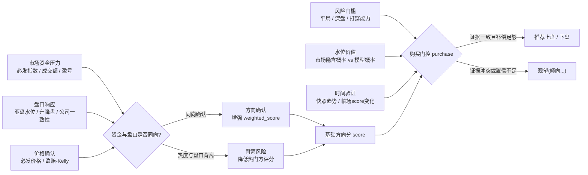
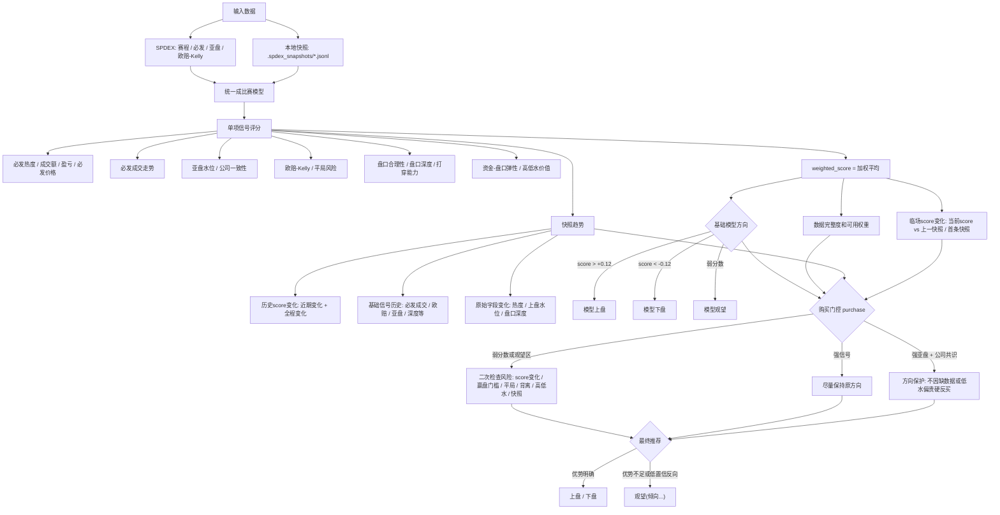

```
python3 worldcup_ah_cli.py --help
python3 worldcup_ah_cli.py predict --help
python3 worldcup_ah_cli.py upcoming --help
python3 worldcup_ah_cli.py snapshot --help
python3 worldcup_ah_cli.py trend --help
python3 worldcup_ah_cli.py watch --help
python3 worldcup_ah_cli.py sources --help
```

### 交易所 + 赔率 API 版（`exchange_odds_ah_cli.py`）

这是替代 SPDEX `tradeflow` 的新程序：用 [The Odds API](https://the-odds-api.com/liveapi/guides/v4/) 拉赛程、`h2h` 欧赔和 `spreads` 让球赔率；用 Betfair Exchange API 的 `listMarketCatalogue/listMarketBook` 拉真实交易所价格、挂单和 `traded volume`。最后仍然复用 `worldcup_ah_cli.Predictor`，所以输出格式和信号体系一致。

```bash
python3 exchange_odds_ah_cli.py --help
python3 exchange_odds_ah_cli.py selftest --verbose
python3 exchange_odds_ah_cli.py sources
python3 exchange_odds_ah_cli.py upcoming --sport soccer_fifa_world_cup --hours 48
python3 exchange_odds_ah_cli.py predict --event-id THE_ODDS_API_EVENT_ID --verbose

# 只用 The Odds API，不查 Betfair；成交走势会明确不可用
python3 exchange_odds_ah_cli.py --no-betfair predict --event-id THE_ODDS_API_EVENT_ID --verbose
```

环境变量：

- `THE_ODDS_API_KEY`：必需，用于 The Odds API。
- `BETFAIR_APP_KEY` + `BETFAIR_SESSION_TOKEN`：可选但强烈建议，用于 Betfair Exchange 的真实成交/挂单数据。
- `BETFAIR_SSOID`：可作为 `BETFAIR_SESSION_TOKEN` 的别名。

数据含义：

- The Odds API 负责外部赔率校验、亚盘/让球水位、欧赔和平局风险；它不是成交量源。
- Betfair Exchange 负责填充 `BfAmount* / BfIndex* / BfOdds*` 和 `必发成交走势`。没有 Betfair 权限时，程序不会用快照或赔率伪装成交走势，只会降低完整度/置信度。
- `selftest` 不访问外网，会用内置 Brazil vs Morocco 样例验证 The Odds API 解析、Betfair traded volume 映射、Predictor 输出和无 Betfair 降级路径。

### 浏览器采集版（`worldcup_web_cli.py`）

当 `app.spdex.com`/`new.spdex.com` 上 **urllib 直连** 因 302、404 或 Cookie 重定向行为拿不到 JSON 时，可在 **已登录、与接口同源** 的浏览器标签里用 `fetch(..., { credentials: 'include' })` 拉取与 `worldcup_ah_cli.SpdexClient` 相同的四个接口的**原始 JSON**，再交给同一套 **`Predictor` 算法** 出推荐。

```bash
# 打印采集脚本路径与示例 bundle
python3 worldcup_web_cli.py print-capture-js

# 使用 bundle（含 match + handicap_list + price_volume + euro_trend 原始体）
python3 worldcup_web_cli.py predict --bundle fixtures/web_bundle.example.json

# 仅用本地 jsonl 里的 match， handicap/成交/欧赔 用空数组（完整度会低，用于冒烟）
python3 worldcup_web_cli.py predict-from-jsonl --jsonl .spdex_snapshots/35035313.jsonl
```

1. 打开仓库内 `scripts/spdex_capture_bundle.js`，在 **DevTools Console** 整段粘贴运行（需在能访问 `/spdexapi/...` 的同源页；若该路径返回 404，请改从 Network 里复制实际 200 的 **Response** 粘进 bundle）。  
2. 将控制台输出的 JSON 存为 `my_bundle.json`。  
3. 执行 `python3 worldcup_web_cli.py predict --bundle my_bundle.json`。

说明：在 Cursor 内置浏览器中对 `https://new.spdex.com/spdexapi/spdex/match_list?...` 的 `fetch` 实测为 **404 JSON**（与命令行 curl 一致）；`/api/spdex/match_list` 为 **403「该接口暂未开放」**。因此采集脚本是否成功取决于当前站点实际开放的 API 路径；**一旦 Network 里能看到 JSON，本工具即可与主 CLI 共用同一套加权与门控**。

### 球探 Titan007 数据源版（`titan007_ah_cli.py`）

从赛程索引（**默认**与 [oldIndexall](https://live.titan007.com/oldIndexall.aspx) 同源的 `livestatic` `bfdata_ut.js`；可选 `bf.titan007.com` 的 `bfdata.js`，或 [竞彩首页](https://jc.titan007.com/index.aspx) 的 `xml/bf_jc.txt`）、`livestatic.titan007.com` 的 `ch_goalbf3.xml` / `sbOddsData.js` 以及 `1x2d.titan007.com/{ScheduleID}.js` 拉取赛程、亚盘矩阵与百家欧赔，**复用** `worldcup_ah_cli.Predictor`。公开页**不提供**与 SPdex 等价的必发分时成交；`price_volume` 在本地存在 **至少两条** `.titan007_snapshots/{ScheduleID}.jsonl` 快照时，由欧赔/必发价变化 **合成** 走势序列（非交易所逐笔）。

```bash
python3 titan007_ah_cli.py --help
python3 titan007_ah_cli.py sources
python3 titan007_ah_cli.py upcoming --hours 48
python3 titan007_ah_cli.py upcoming --hours 168 -w --with-okooo
# -w/--wc/--world-cup 只列世界杯；--with-okooo 多列澳客 okooo_id（等同加 --okooo-bifa）
python3 titan007_ah_cli.py --schedule-source bf upcoming --hours 48   # 显式改用 bf 域 bfdata.js
python3 titan007_ah_cli.py --schedule-source jc upcoming --hours 48   # 竞彩 bf_jc.txt（子集）
# 同上，但为每场拉 1x2d（数百场时极慢，一般不需要）
python3 titan007_ah_cli.py upcoming --hours 48 --fetch-euro
python3 titan007_ah_cli.py predict --match-id 2931221
# 单场「完整」预测一条命令（默认：.env + refresh + 澳客必发 + verbose；等价于 --okooo-bifa predict）
python3 scripts/titan007_one_match.py 2906745
python3 scripts/titan007_one_match.py predict 2906745 --okooo-ids 2906745=1316319 --json
# 未来赛程：每行 ScheduleID + 澳客 okooo_id（启发式或 .env 映射）
python3 scripts/titan007_one_match.py upcoming --hours 72 --limit 40
python3 scripts/titan007_one_match.py upcoming -w --hours 200 --limit 25 --json
# 轮询写快照，便于合成必发走势 + 快照趋势
python3 titan007_ah_cli.py watch --match-ids 2931221 --interval 120
```

环境变量：`TITAN007_COOKIE`（可选）、`TITAN007_POLL_SEC`、`TITAN007_SNAPSHOT_DIR`（默认 `.titan007_snapshots`）、`TITAN007_SCHEDULE_TZ`（开赛墙钟时区；**球探逗号里的月份为 JS 0–11**）、`TITAN007_SCHEDULE_SOURCE`（未传 `--schedule-source` 时生效；**未设置时 CLI 默认 live**）、`TITAN007_OKOOO_BIFA`（`1`/`true`/`on` 时合并澳客必发盈亏到 `Bf*`，也可用 `--okooo-bifa`）、`TITAN007_OKOOO_IDS`（如 `2906745=1316319` 显式对齐澳客比赛 ID）、`OKOOO_TITAN_MAP_PATH`（JSON 映射文件）、`OKOOO_BETFA_URL`、`OKOOO_COOKIE`（未设则回退 `TITAN007_COOKIE`；**必发明细页** `…/soccer/match/{okooo_id}/exchanges/detail/` 与 betfa 共用，用于 Titan007 必发成交走势）、`TITAN007_ASIAN_SIGN_FROM_WATER`（默认 `1`：用主客均水把无符号正盘口纠正为 **主让=负盘口**）、`TITAN007_ASIAN_SIGN_FROM_ML`（默认 `1`：拉完 1x2/必发胜赔后再用 ML 热门校正半球~一球上「受让低水」误判；设 `0` 关闭）。接口与 Referer 要求见 [docs/titan007_feeds.md](docs/titan007_feeds.md)。

赛程索引：`live`（默认）为 [oldIndexall](https://live.titan007.com/oldIndexall.aspx) 使用的 `livestatic` `bfdata_ut.js`；`bf` 为 `bf.titan007.com/vbsxml/bfdata.js`；`jc` 为 [竞彩首页](https://jc.titan007.com/index.aspx) 的 `xml/bf_jc.txt`（**竞彩开售子集**）。页面顶部日期切换不等于索引里已有该日全部比赛；若索引里开赛时间仍都早于当前 UTC，CLI 同样列不出「未来」。

`upcoming` 默认**不**对每场请求 `1x2d`（否则与 `bfdata` 场次数成正比、串行 HTTP 极易长时间卡住）；仅 `--fetch-euro` 时才会逐场拉欧赔。`bfdata.js` 索引有时是**近期/已赛滚动切片**，若其中所有开赛时间都已早于当前 UTC，则无论 `--hours` 多大都不会列出「未来」场次（属数据源范围，非解析错误）。**球探侧未发现**与 `bfdata.js` 同格式的「世界杯专用」备用 URL（其它 `bfdata*.js` 多为 404 页）。

筛世界杯可用 ``--world-cup``、``-w`` 或 ``--wc``；跨度大时用 ``upcoming --all-future -w --limit 5``。

`--all-future` 表示不按 `--hours` 截断上界；``--world-cup`` 按联赛名匹配 世界杯 / 世界盃 / World Cup（不必再手写 ``--league-contains 世界杯``）。

与 SPdex 版差异：必发指数/成交量/盈亏多为空，相关信号常不可用；欧赔/Kelly 来自 1x2d 多公司行近似；完整度与稳定性取决于球探前端协议变更。

SPdex 版核心信号：

- 必发指数、成交额、盈亏指数、必发价格确认
- 必发成交走势
- 亚盘水位和主流公司一致性
- 欧赔/Kelly 与平局风险
- 盘口合理性、盘口深度、深盘打穿能力、赢盘门槛风险
- 资金/盘口弹性：热度变化后，盘口是否降水、升盘或反向放松
- 高低水价值：把水位转换成隐含赢盘率，比较模型概率是否给出足够赔率补偿
- 外部赔率/实力校验：预留 The Odds API、Elo、伤停/阵容模型字段
- 本地 `.spdex_snapshots/` 快照趋势
- 临场 `score` 变化：当前综合分相对上一条/首条快照的变化

信号之间的关系：

所有信号都会先被归一到同一个方向坐标：`+1` 表示支持上盘，`-1` 表示支持下盘，`0` 表示中性或不可用。因此它们可以进入同一个加权模型。但模型不是简单相信“哪个信号大”，而是重点看信号之间是否互相确认：

- 必发热度、成交额、盈亏指数代表市场资金压力。
- 亚盘水位、升降盘、主流公司一致性代表盘口是否响应这股资金压力。
- 必发价格、欧赔/Kelly 代表价格端是否确认强弱方向。
- 平局风险、盘口深度、打穿能力、赢盘门槛风险代表买上盘是否需要更高胜出条件。
- 高低水价值把水位换算成市场隐含概率，判断当前赔率是否给了足够补偿。
- 快照趋势和临场 `score` 变化负责时间维度，判断信号是在增强、转弱，还是临场突然反向。

最核心的关系是：如果热门方资金很热，盘口也通过降水或升盘响应，价格端也确认，这通常是同向确认；如果热门方很热，但盘口不升反降、上盘升水，或临场 `score` 明显转弱，就会被视为背离信号。



算法流程图：



推荐逻辑：

- `score` 是基础模型综合分，默认阈值为 `+/-0.12`：正分偏上盘，负分偏下盘，弱分数为观望。
- `score` 的变化很重要：快照趋势会同时看最近一段 `score` 变化、从第一条到最新一条的总变化，以及必发成交、欧赔/Kelly、亚盘水位、盘口深度等基础信号的历史变化。
- 目前快照趋势里，历史 `score` 变化约占趋势判断的 35%；基础信号历史约占 65%。如果热度升高但上盘水位也升高，会额外扣分；如果热度升高且上盘降水，会额外加分。
- 预测本轮还会额外生成 `临场score变化`：用当前刚算出的 `score` 对比上一条快照和首条快照。它不进入基础 `weighted_score`，但会进入 `purchase` 门控；如果当前 `score` 跌破/升破阈值，或与历史快照趋势冲突，会直接修正购买分，并降低旧快照趋势的影响。
- 最终 `推荐` 是购买建议，可以是 `上盘`、`下盘` 或 `观望(倾向...)`；低置信反向、可用数据不足、方向和购买优势都太弱时不会强行二选一。
- `purchase` 是购买门控后的分数。只有当原始优势较弱或模型处于观望区时，才会额外参考赢盘门槛风险、快照趋势、盘口背离、公司一致性、高低水价值等信号做二次修正。
- 强亚盘水位和主流公司一致性同向时，会保护原方向，避免因为缺实时接口或低水偏贵被硬反买；缺数据更多体现为降低置信度。
- 高水只有在模型估计赢盘率明显高于市场隐含概率时才加分；低水如果已经偏贵但缺少模型溢价会扣分，但遇到强盘口共识时会降权处理。
- `置信度` 表示最终购买建议的把握，不等于命中概率；数据越完整、基础分越强、快照和盘口越同向，置信度越高。风险门控、数据缺口、反向证据会降低置信度。

自动快照：

```bash
python3 worldcup_ah_cli.py watch --limit 20 --verbose
```

`watch` 会扫描未来 24 小时比赛，按 `T-24h/T-8h/T-4h/T-3h/T-2h/T-60m/T-30m/T-15m` 自动保存快照并打印预测。

- `T-24h/T-8h/T-4h/T-3h/T-2h`：预判窗口，用来积累必发、赔率、盘口和水位趋势。
- `T-60m/T-30m/T-15m`：正式复核/确认窗口，用来形成临场购买建议。
